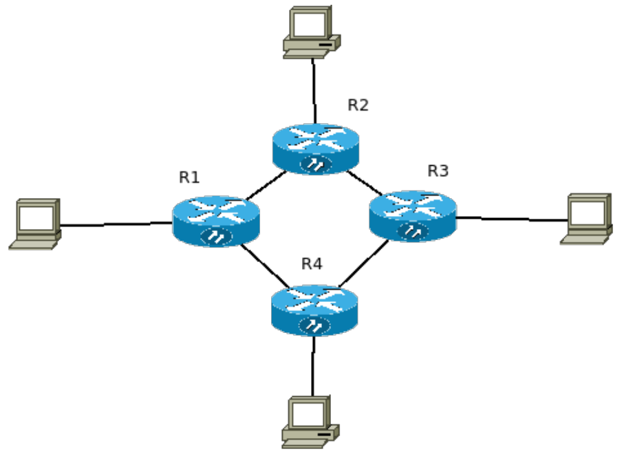

# Projeto de redes com roteamento entre domínios sem classes

 Consiste num projeto de redes feito utilizando endereçamento IP sem classes. 

## Sobre:

 Esse projeto foi desenvolvido para a disciplina Redes de Computadores II, seguindo os requisitos do diagrama abaixo: 

## Modo de uso:

- Abrir o arquivo .pkt usando o programa Packet Tracer