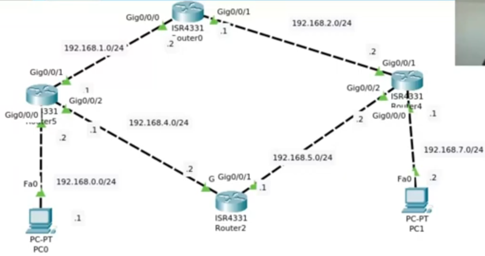

# Projeto de redes usando o protocolo RIP

 Consiste num projeto de redes que utiliza o protocolo RIP versão 1 para definir rotas estáticas. 

## Sobre:

 Esse projeto foi desenvolvido para a disciplina Redes de Computadores II, seguindo os requisitos do diagrama abaixo: 

## Modo de uso:

- Abrir o arquivo .pkt usando o programa Packet Tracer